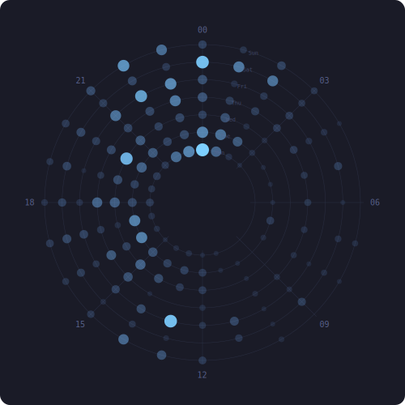

# Hey, I'm Paul Pessoa

**Full-Stack Engineer (Frontend Focused)**

6+ years of experience building scalable web applications in Ag-Fintech and Enterprise SaaS environments. 
Based in Recife, Brazil (GMT-3) · 6+ years working remotely with distributed teams across US, Europe, and LATAM.

---

## 💼 Professional Summary

* **Ag-Fintech Experience (Traive):** Designed and evolved complex financial interfaces used by agribusiness clients across LATAM, collaborating closely with product, backend, and data teams to ship reliable, high-performance features.
* **Enterprise SaaS Experience (GEP Worldwide):** Contributed to enterprise-grade procurement and analytics platforms serving 400+ global organizations, including 25+ Fortune 500 companies, delivering interactive dashboards and data-heavy workflows with measurable business impact.
* **Mentorship & Community:** Founded **Menvo**, a volunteer mentorship initiative aimed at democratizing access to career guidance and professional development for students.

---

## 🔨 Featured Projects

### [GagaList 🧺](https://github.com/paulpessoa/gaga-list)
An AI-powered smart grocery list Progressive Web App (PWA) built for extreme mobile-first performance and household logistics.
* **Tech Stack:** Next.js 15, Tailwind CSS 4.0, Supabase, Vercel.
* **Key Features:** Computer Vision (OCR photo-to-list via GPT-4o-mini), Hybrid local audio transcription, real-time map GPS tracking ("Cadê Tu?"), and QR-based instant boarding.

### [Estagionauta 🚀](https://github.com/paulpessoa/estagionauta)
A modern SaaS platform designed to accelerate student integration into the job market.
* **Tech Stack:** React (Vite), Hono.js (TypeScript), Supabase (PostgreSQL + RLS), Stripe, Brevo, Gemini/OpenAI API, Playwright, Vitest.
* **Key Features:** Intelligent CV analysis focusing on academic projects, voice-enabled interview simulator, agency integration feed, and internship law recess calculator.

### [Menvo 🤝](https://github.com/paulpessoa/menvo)
A free mentoring platform connecting experienced professionals with students seeking guidance for their first jobs.
* **Tech Stack:** Next.js, React, Supabase, Tailwind CSS, Radix UI.
* **Key Features:** Real-time chat integration, video call booking system, and Google Calendar sync.

### [Notidem ✍️](https://github.com/paulpessoa/notidem-repo)
An open-source Chrome extension that helps users draft genuine, on-brand LinkedIn comments in their own voice.
* **Tech Stack:** Chrome Manifest V3, Vanilla JavaScript, Web Crypto API (AES-GCM encryption at rest).
* **Key Features:** Isolated worker background key-handling, context-aware tone selector, local-only storage, and synthetic editor paste.

---

## 🧰 Focus Areas & Tech Stack

* **Frontend Architecture:** React, Next.js, TypeScript, HTML5, CSS3, Sass
* **State & Data Management:** REST, GraphQL, React Query, Zustand, Supabase, PostgreSQL
* **Performance & Maintainability:** Component-driven systems, scalable UI patterns, bundle optimization
* **Observability & Analytics:** Datadog, Clarity, Mixpanel
* **Cloud Infrastructure:** AWS, Azure, GCP
* **Modern Developer Tools:** Claude Code, Cursor, Codex, Gemini CLI, Kilo Code, Kiro, Anthropic API, Perplexity, MCP

---

## 📊 Stats

---

## ⏱ Commit Clock

*Inner ring = Monday, outer = Sunday. Midnight at top. Updated weekly.*

---

## 🌍 Languages & Collaboration

* 🗣️ **Languages:** Fluent in English, Portuguese, and conversational Spanish.
* 👥 **Collaboration:** Highly experienced in international, distributed collaboration.

---

Open to collaboration, open-source projects, and engineering challenges.

